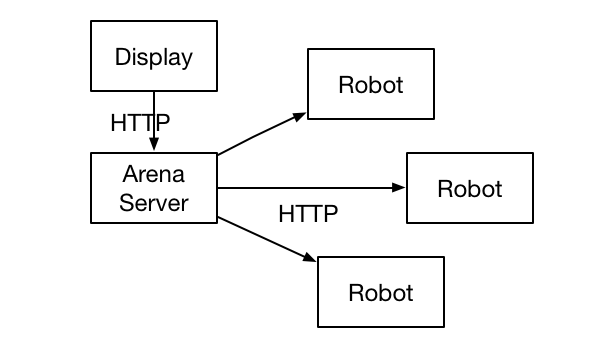

# Pi Fight

Pi Fight allows virtual robots to fight one another. Each robot resides
on its own separate machine. The code here is a central server which
communicates with each robot, determnes what happens, and displays the
results. If individual robots are players, this server is like the
game master.

The protocol for communicatng with robots is described in doc/Protocol.md.

Individual robots can run on anything but this project was created
with Raspberry Pi in mind. Raspberry Pi makes a consistent, portable,
affordable robot platform. We can ensure all robots have the same
computing resources available and nobody has to break the bank.

Pi Fight was inspired by the 1981 game [RobotWar by Muse Software](http://corewar.co.uk/robotwar/index.htm).

## Documentation

In addition to this README you can find information in the `doc`
directory including:

- [MVP.md](doc/MVP.md) List of the minimum features necessary to conduct an
actual robot battle. Work in progress
- [TODO.md](doc/TODO.md) Other needed work
- [Protocol.md](doc/Protocol.md) Description of the protocol you can use to write your
own robots
- [Rules.md](doc/Rules.md) Suggested rules for conducting a robot battle

## Installation

See [Installation.md](doc/Installation.md)

## Development

Your pull requests are very welcome! The front end code could especially
use some love from somebody with CSS and/or Javascript chops.

I can't merge your pull request unless the tests still pass, but I will
happily work with you to make that happen. Go ahead and submit your
change and I'll take a look. Thanks!

## Legal

Copyright (c) 2014 Michael Kennedy Brodhead

This program is free software: you can redistribute it and/or modify it under
the terms of the [GNU General Public License](doc/LICENSE.txt) as published by
the Free Software Foundation, either version 3 of the License, or (at your
option) any later version.

This program is distributed in the hope that it will be useful,
but WITHOUT ANY WARRANTY; without even the implied warranty of
MERCHANTABILITY or FITNESS FOR A PARTICULAR PURPOSE.  See the
GNU General Public License for more details.

You should have received a copy of the GNU General Public License
along with this program.  If not, see <http://www.gnu.org/licenses/>.
